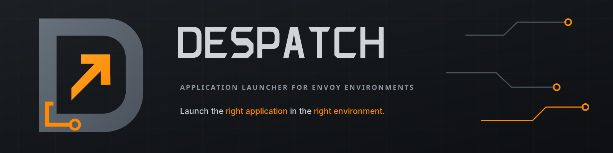

# Despatch

Despatch is a Windows-first system tray launcher for applications managed by
[Envoy](https://github.com/gtvfx-envoy/envoy). It discovers explicitly
declared application metadata from active Envoy bundles, presents a fast
searchable catalog, and always dispatches commands through Envoy's concatenated
environment.

Full user and implementer documentation is available at
[gtvfx-envoy.github.io/despatch](https://gtvfx-envoy.github.io/despatch/).
The standalone executable also includes the site for offline use:

```powershell
despatch --docs
```

## Runtime

Despatch targets the studio's Envoy-provided Python 3.11.9 environment. That
environment supplies the `Qt` compatibility shim and its selected Qt binding.
Application code imports from `Qt`; it does not import a binding directly.
Despatch requires Envoy 0.5.1 or newer for the shared config-root API.

Before running or developing Despatch, verify the environment:

```powershell
envoy --info python
envoy --which python
envoy python -c "import sys, Qt; print(sys.version); print(Qt.__binding__)"
```

Start the tray application with:

```powershell
envoy despatch
```

Show the main launcher immediately:

```powershell
envoy despatch --popup
```

Left-clicking the tray icon shows or raises the launcher. Right-clicking opens
a compact menu containing favorite applications, Envoy Stack switching,
refresh, settings, and quit actions. Closing the main window hides it to the
tray.

Despatch uses the Stack saved in Envoy's shared `stack` user setting. Named
Stacks and custom `.estack` files can be selected from the launcher. When no
Stack is saved, Despatch asks the user to choose one before presenting
applications. Set `ENVOY_DEV_MODE=1` to default an otherwise unconfigured
session to Automatic resolution. Automatic resolution can also be selected
manually for the current session.

## Development

All Python tooling must run through Envoy:

```powershell
envoy python -m pytest
envoy python -m ruff check .
envoy python -m build
```

Do not substitute a system `python` or `pip`; it will not contain the assembled
runtime used by Despatch.

## Standalone executable

Build the Windows executable locally from an Envoy environment containing
Python, Qt.py, PySide6, and the Envoy Python API:

```powershell
.\scripts\build-executable.ps1
```

The script installs its pinned documentation and PyInstaller build tools under
the ignored `build/` directory when necessary. It builds the ProperDocs site,
then writes the one-file, windowed executable to `dist/despatch.exe`. Pass
`-SkipToolInstall` to require the build tools to be available already, or
`-PythonExecutable <path>` to build with an explicitly prepared Python 3.11
environment instead of `envoy python`. `-Console` creates a temporary
console-enabled build when diagnosing packaged startup failures.

The `Build & Release` GitHub Actions workflow runs the same script on Windows.
Manual runs retain the executable as a workflow artifact; tags matching `v*`
also attach `despatch.exe` to the corresponding GitHub Release. The workflow
pins the Envoy release embedded into the executable and exposes an override for
manual compatibility builds.

Windows CI jobs bootstrap that pinned Envoy release under the runner's temporary
directory. The `ENVOY_BUILD_STACK` repository Actions variable selects the
shared Stack used for Python commands. That Stack supplies Python 3.11, PySide6,
and Qt.py from Envoy Bundles, while the bootstrap exposes the pinned Envoy Python
API through `ENVOY_SITE_PACKAGES`. The Windows bundle and Python wheel are both
verified against Envoy's `SHA256SUMS` before installation.

## Application manifests

Bundles opt into the GUI by adding `.envoy/despatch.json`. Unlisted Envoy
commands remain available from the command line but are not shown in Despatch.
See [the manifest reference](docs/technical/manifests.md) for the schema and
validation rules.

## Current milestone

The initial release covers named and custom Envoy Stacks, manifest discovery,
search, favorites, history, tray controls, application launch, terminal launch,
settings, login startup, global shortcut registration, and actionable errors.
Historical Stack browsing, feature overlays, and detailed cache
management are intentionally deferred until their Envoy APIs are stable.
