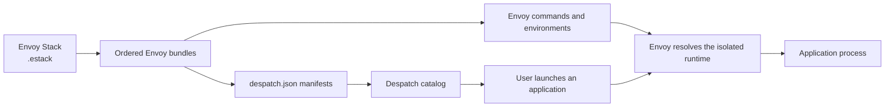

# Despatch

**A fast application launcher for Envoy-managed environments.** Despatch turns
the applications declared by your team's Envoy bundles into a searchable
desktop launcher, while Envoy continues to assemble and isolate each
application's runtime environment.

## Start here

=== "I use applications"

    Begin with [Getting Started](user/getting-started.md). It explains how to
    open Despatch, choose an environment, find applications, and use the tray
    menu without requiring command-line knowledge.

=== "I configure environments"

    Read [Stack Files](technical/stack-files.md) and
    [Bundle Manifests](technical/manifests.md) to define which bundles make up
    an environment and which applications appear in the launcher.

=== "I am troubleshooting"

    Use [Troubleshooting](troubleshooting.md) to diagnose missing applications,
    invalid Stacks, launch failures, and unavailable global shortcuts.

## How Despatch fits with Envoy

Despatch does not replace Envoy configuration. It provides a friendly launch
surface for a selected Envoy **Stack**, which is an ordered collection of
**bundles** forming one isolated runtime environment.

!!! tip "Documentation is available offline"

    The standalone executable contains this entire site. Run
    `despatch --docs`, select the **?** button in the launcher, or choose
    **Documentation** from the tray menu.

For Envoy concepts beyond what Despatch needs, see the
[complete Envoy documentation](https://gtvfx-contrib.github.io/gt-envoy/).
