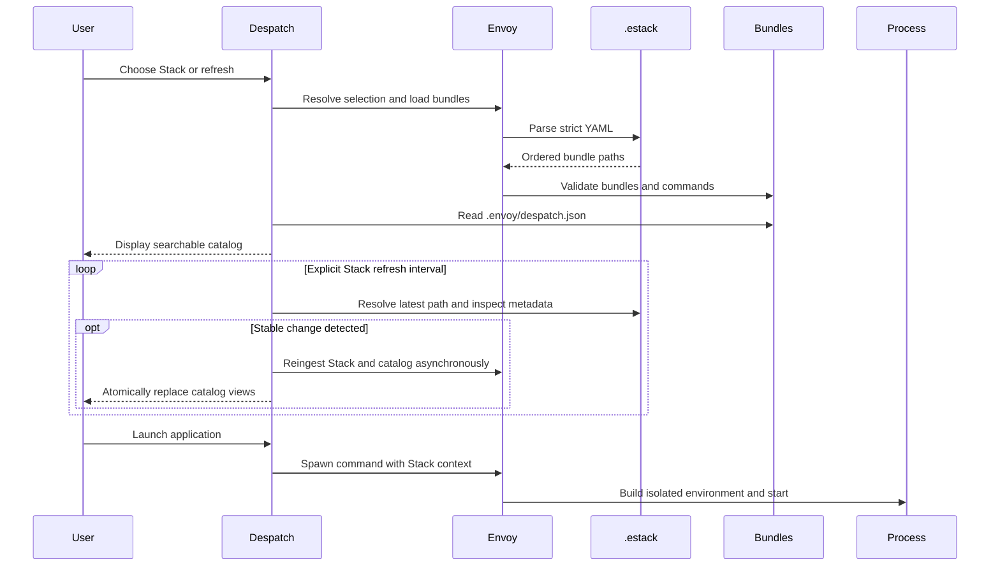

# Architecture

Despatch is a presentation and dispatch layer over the Envoy Python API. It
does not resolve command environments itself.

## Responsibilities

| Component | Responsibility |
|---|---|
| Envoy Stack | Selects the ordered bundles forming a runtime container |
| Envoy bundle | Declares commands and environment files |
| Despatch manifest | Selects and describes commands exposed in the UI |
| Despatch settings | Stores local presentation and convenience preferences |
| Envoy user config | Stores the shared selected Stack |
| Stack monitor | Probes explicit Stack metadata and requests safe reingestion |

Catalog refreshes and launches run outside the Qt UI thread. Application launch
uses an isolated worker so frozen and source executions produce the same Envoy
runtime behavior.

Stack probes use a single daemon worker and never overlap. Named selections
re-resolve their registry pointer before inspecting the immutable versioned
file; custom selections inspect the chosen path. Automatic resolution has no
Stack monitor. The last successful catalog remains active throughout probes,
reloads, and recoverable failures.

## Source and frozen execution

Despatch supports the Envoy-provided Python 3.11 runtime and a one-file Windows
executable. The executable contains Envoy, Qt.py, PySide6, product resources,
and this documentation site. The same manifest, Stack, and settings formats
apply in both modes.
