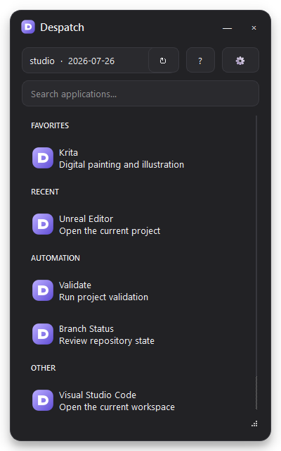

# Launcher and Tray

## Main launcher

The toolbar contains the active Stack, **Refresh**, **Documentation**, and
**Settings** controls. Refresh reloads named Stacks, active bundles, manifests,
favorites, and recent state without restarting Despatch.

### Search and keyboard controls

| Action | Control |
|---|---|
| Focus search | ++ctrl+f++ |
| Launch first visible result | ++enter++ in the search field |
| Hide the launcher | ++esc++ or the close button |
| Move the launcher | Drag its title bar |
| Resize the launcher | Drag its lower-right corner |

Search is not case-sensitive and checks the display name, description, Envoy
command, keywords, and bundle identity.

### Application menu

Right-click an application to access:

- **Run in terminal** — launches this invocation in a new terminal even when
  its manifest normally uses a background process.
- **Add to Favorites** or **Remove from Favorites** — updates the persistent
  Favorites section and tray shortcuts.
- **Copy Envoy command** — copies a correctly quoted command, including the
  explicit Stack when required, for use in a terminal or support request.

## Notification-area menu

Right-click the Despatch tray icon to:

- Show the launcher.
- Start any favorite directly.
- Switch between Automatic resolution, named Stacks, and a custom Stack.
- Refresh the catalog.
- Open Settings or Documentation.
- Quit Despatch.

Left-clicking the icon opens or raises the main launcher. Hover over it to see
the active Stack mode.

## Favorites and history

Favorites and the latest 20 launched applications are stored in Despatch's
user settings. They are local to your account and do not modify Stack or bundle
files. If an application disappears from the active Stack, its stored identity
is retained but it is not displayed until the application becomes available
again.
