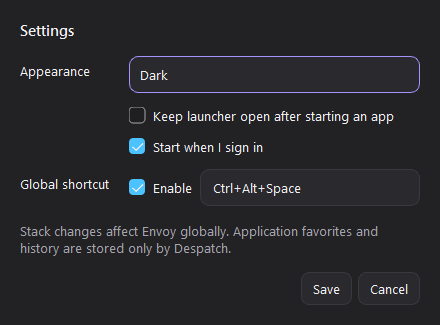

# Settings

Open Settings from the **gear** button or the tray menu.

## Appearance

Choose **Follow system**, **Light**, or **Dark**. Changes apply immediately
after saving.

## Launch behavior

Enable **Keep launcher open after starting an app** when launching several
tools in succession. Otherwise the launcher hides after Envoy reports a
successful process start.

## Start at sign in

On Windows, Despatch can register itself for the current user's login. This
requires the `envoy` or `en` executable to be available on `PATH`. Disabling the
setting removes the registration and its generated launcher script.

## Global shortcut

Enable the system-wide shortcut to show Despatch from another application. A
shortcut must contain at least one modifier and a supported key, for example:

- `Ctrl+Alt+Space`
- `Ctrl+Shift+D`
- `Alt+F10`

If another application already owns the shortcut, Despatch reports the
conflict and preserves the previous setting. Global shortcut registration is
currently implemented for Windows.

## Where preferences are stored

Despatch stores theme, favorites, history, window geometry, and launcher
behavior separately from Envoy's shared Stack selection. Technical locations
and JSON fields are listed in [Configuration](../technical/configuration.md).
