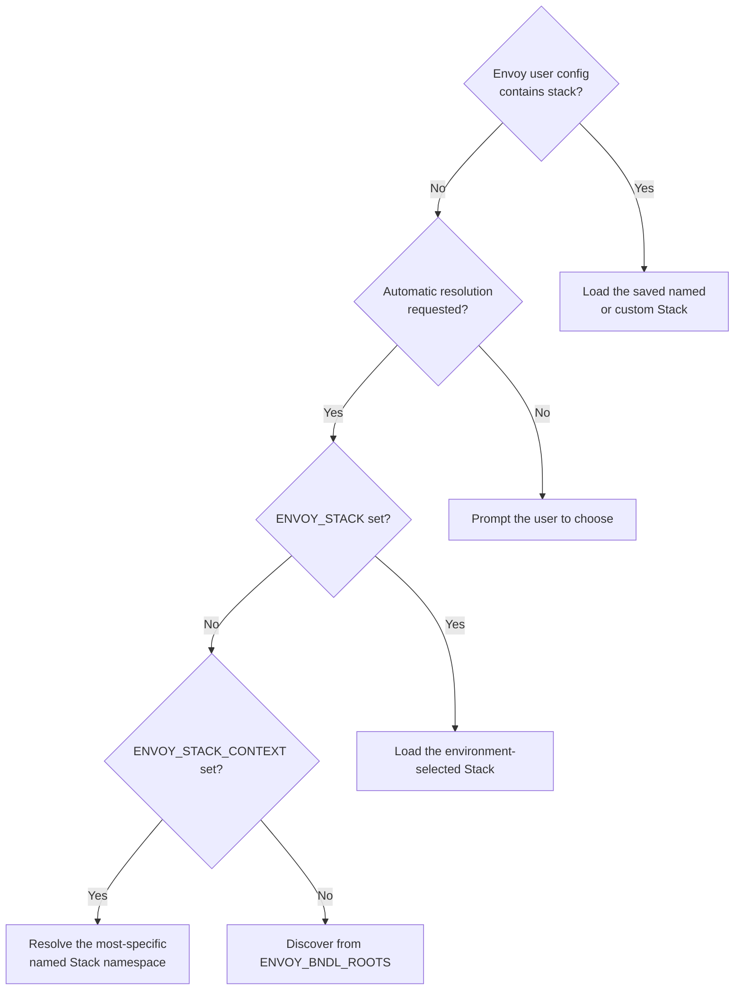

# Choosing a Stack

A Stack is the environment container used for catalog discovery and launches.
Changing it affects both which applications appear and the environment in which
they run.

## Named Stacks

Named Stacks are published and maintained by your studio. Choose one by name in
the selector. Despatch resolves its latest published version and displays the
version in the Stack tooltip where available.

## Custom Stack files

Choose **Choose custom Stack…** to select a `.estack` file from disk. Custom
files are useful for project-specific or experimental environments that have
not been published as named Stacks.

Stack files are strict YAML and every referenced bundle must exist. If the file
is invalid, Despatch keeps the prior Stack active and reports the error.

## Automatic updates

Despatch checks the selected named or custom Stack for updates in the
background. The launcher and tray catalog are reloaded automatically after a
change is stable. The existing catalog remains available while the update is
being checked and loaded.

For a named Stack, Despatch follows the registry's `latest` pointer so a newly
published version is detected even though each versioned `.estack` file is
immutable. For a custom Stack, Despatch watches the selected file's lightweight
filesystem metadata. It does not repeatedly read or hash the document.

A brief **Stack updated automatically** message confirms a successful reload.
If the file or registry cannot be checked, an amber warning appears without
blocking the launcher. Despatch continues using the last successfully loaded
catalog and clears the warning after the connection recovers.

The interval defaults to five minutes and can be changed under **Settings**.
Automatic resolution does not monitor a Stack file because Envoy discovers its
bundles dynamically.

## Automatic resolution

Automatic resolution delegates bundle selection to Envoy rather than loading
an explicit Stack file. It is useful for developers working in bundle checkouts
configured through `ENVOY_BNDL_ROOTS` or other Envoy discovery sources.

!!! note

    Selecting a named or custom Stack updates Envoy's shared `stack` user
    setting. Favorites, history, theme, and other launcher preferences remain
    Despatch-only settings.

## Resolution at startup

The selector directly honors Envoy's shared `stack` setting. In Automatic mode,
Envoy then applies its own discovery precedence: `ENVOY_STACK`, contextual
named Stack resolution, and finally `ENVOY_BNDL_ROOTS` discovery.
